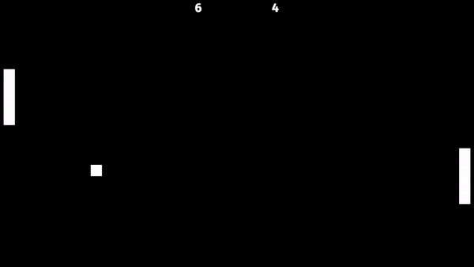

# Pong-Rust
A basic pong game made with Rust.

# 

## Description
I used Bevy(Rust game engine) and made simple pong game.  
You can move left paddle with **W** and **S**, and the right paddle with **Up** and **Down** Arrows.

## Platforms / Technologies
* [Rust](https://www.rust-lang.org/en-US/)
* [Cargo](https://doc.rust-lang.org/cargo/)
* [Bevy](https://bevyengine.org/)

## Run
>      $ cargo run

## Build For Release
>      $ cargo build --release
